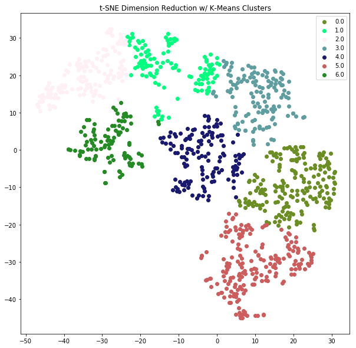
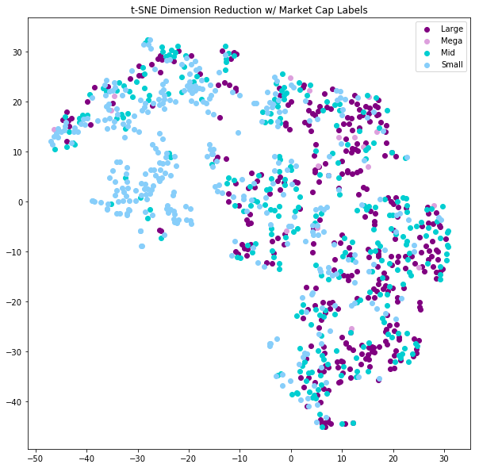

# Clustering_by_Fundamentals
Clustering analysis of stocks using fundamental ratios

## Goal

My goal for this project is to investigate whether or not any patterns exist in the financial statement data of various companies which can lead to meaning insights in how they may be grouped together.  I will attempt to answer this question through performing a cluster analysis utilizing various dimension reduction and machine learning techniques.

## The Data

The dataset used in this analysis comes from [Simfin](https://simfin.com) which provides open source access to the fundamental data of 1564 companies with their respective financial statements data dating back to 2009. I was able to extract the data from a bulk-downloaded .csv file of their entire dataset with the help of an extractor that can be found on this [Github](https://github.com/SimFin/bd-extractor) page. In addition, I queried the [IEX API](https://iextrading.com/developer/docs/) in order to acquire sector labels for each company in an effort to provide additional comparisons to traditional company classifications.

### Features

Originally the data was comprised of 61 features which included the original financial statement data and ratios thereof. The final feature set was chosen after considering only ratios and, of those ratios, only measures that did not factor in the price of the stock. The reason for this selection criteria was to avoid simply identifying the signal of company size and stock price.    

| **Net Profit Margin** | **Return on Equity** | **Return on Assets** |
| :-----------: | :------------: | :-----------: |
| Income(Loss)/ Revenue | Income(Loss) / Total Equity |Income(Loss) / Total Assets |

| **Current Ratio** | **Liabilities to Equity** | **Debt to Assets** |
| :-------: | :--------:| :-------: |
| Current Assets / Current Liabilities | Liabilities / Equity | Debt / Assets |

### Distribution

The company list included a small group of outliers with extreme valuation readings. In order to better identify the clusters of companies which were more representative of the population majority, I decided to remove those names who fell more than three standard deviations away from the mean of each feature. In total, 18 companies were removed through this process. In the end, the final group included in the analysis was comprised of 986 companies.

| **Market Caps (billions)** |
| :-------: |
| Small(0-2)|362|
| Mid(2-10)|289|
|Large(10-200)|336|
|Mega(200+)|17|

| **Sectors** |                    
| :--------: |
| Basic Materials |47|
|Communication Services |15|
|Consumer Cyclical |160|
|Consumer Defensive |60|
|Energy |50|
|Financial Services |34|
|Healthcare |137|
|Industrials |148|
|Real Estate |55|
|Technology |197|
|Utilities |32|

## Modeling
The data was standardized by subtracting the mean and dividing by the standard deviation of each feature prior to applying the following methods.  

### PCA
In order to better visualize the data and understand if any noticeable clustering was occurring, I used PCA(Principal Component Analysis) to reduce dimensionality. Each PCA component represents a linear combination of the original features. Below is a plot of the cumulative explained variance for a range of components which helps us to understand how many principal components to use in applying PCA.

Next, I plotted the data in three PCA dimensions. These three dimensions explain roughly **74%** of the variance in the data. As we can see at a glance, the data does not appear to have any noticeable clusters that emerge.  

### t-SNE

After exploring linear dimensionality reduction, I proceeded to investigate whether or not applying a non-linear technique would help to identify patterns in the data. I ran the t-SNE(t-distributed Stochastic Neighbor Embedding) algorithm on the standardized data which embedded the data into 2-dimensions.
This algorithm first converts the similarity between data points into joint probabilities and then defines a similar probability distribution of the points mapped into lower dimensional space. The final step involves minimizing the Kullback-Leibler divergence between the two distributions with respect to the locations of the points in the map.    

### K-means

Following the mapping of the data into 2-dimensions using t-SNE, I utilized a K-means clustering algorithm in order to find the an optimal number of clusters that define the data in the dimension-reduced space. Below is a plot of the average silhouette scores over a range of different numbers of clusters. The closer the score is to +1 the better the number of chosen clusters separate the data.

    

## The Results

The final cluster analysis appears to show some interesting results. I decided to choose the number of clusters based on the highest silhouette score between 4 to 10 clusters which was **7**. The reason for this selection was to understand if there would be more informative characteristics in each cluster by looking at a larger number of groupings than simply 1 to 3.

The following plot overlays the market cap categories onto the t-SNE mapping. It displays a noticeable pattern in the 7th cluster(labeled 6). The 7th cluster is dominated by small cap companies.

In addition to looking at market cap labels, we can also evaluate the embedded data after applying each stock's respective sector classification. There are a few sectors that appear to cluster together such as utilities and real estate.

The bar plots display the averages for each feature per cluster. The most dramatic difference between clusters is clear in the 7th cluster. This cluster has the poorest average measures in Net Profit Margin, Return on Equity, Return on Assets, and Liabilities to Equity.

** Stocks Most Closely Related to Centroids **

| 0 | 1 | 2 | 3 | 4 | 5 | 6 |
|---|---|---|---|---|---|---|
| TWX | CSU | MRVL | DHR | LFUS | PEP | CPST |

## Next Steps

Implementing an unsupervised learning technique such as clustering can serve as a potentially impactful addition to a predictive model. In order to further this investigation, my goal will be to add these cluster labels to the dataset and attempt to predict the market cap of each company using the ratios from this analysis, their cluster labels, and a variety of other applicable features derived from their financial statements. This type of model may be useful in helping with valuations of private companies which lack the direct feedback from the public market in applying a valuation. In addition, I would like to extract further meaning from these clusters by looking at the return characteristics of the groupings to see if each has a distinct return profile.
